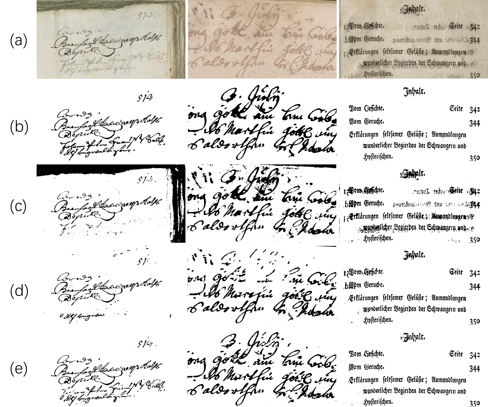

# DocTrKan

Use Python version 3.8

<!-- [](https://replicate.com/cjwbw/docentr) -->


 
## Description
Pytorch implementation of the paper [DocTrKan: Document Image Enhancement Based
on KAN-Enhanced Transformer Networks](). This model is implemented on top of the [vit-pytorch](https://github.com/lucidrains/vit-pytorch) vision transformers library,Added [KAN](https://github.com/Blealtan/efficient-kan) enhanced vit. The proposed model can be used to enhance (binarize) degraded document images, as shown in the following samples.
 
<table style="padding:10px">
    <tr>
        <td style="text-align:center"> 
            
        </td>
    </tr>
</table>

The plot illustrates the processing results of various models applied to the DIBCO2018 dataset. The images labeled (a) through (e) are as follows: (a) the original image, (b) the ground truth (GT), (c) the Otsu model, (d) the DocEnTr model, and (e) the DocTrKan model.

## Download Code
clone the repository:
```bash
git clone https://github.com/zyk326/DocTrKan.git
cd DocTrKan
```
## Requirements
- pip install -r requirements.txt

After downloading the changeCode folder, you need to manually add and replace the kan folder and vit. The kan folder should be placed in a subdirectory of your environment so that the vit file can successfully call kan. As for vit, you will need to make manual modifications during your experiments. The provided vit is only a template; you can locate the vit file in your own environment and incorporate the lines we added into our vit file. Alternatively, you can directly replace the vit file.  

Assuming you are using a virtual environment named DocTrKan with Python, you need to place the efficient_kan folder under YOUR_ENV_PATH/DocTrKan/lib/python3.8/site-packages/. Then, locate the vit file at YOUR_ENV_PATH/DocTrKan/lib/python3.8/site-packages/vit_pytorch/vit, and replace your existing vit file with the one from the changeCode folder.
## Process Data
### Data Path
We gathered the DIBCO, H-DIBCO and PALM datasets and organized them in one folder. You can download it from this [link](https://drive.google.com/file/d/16pIO4c-mA2kHc1I3uqMs7VwD4Jb4F1Vc/view?usp=sharing). After downloading, extract the folder named DIBCOSETS and place it in your desired data path. Means:  /YOUR_DATA_PATH/DIBCOSETS/

### ⚠️ Data License
Be aware that these datasets have their own Licences, they are not included under the Licence of this repository.
 
### Data Splitting
Specify the data path, split size, validation and testing sets to prepare your data. In this example, we set the split size as (256 X 256), the validation set as 2016 and the testing as 2018 while running the process_dibco.py file.
 
```bash
python process_dibco.py --data_path /YOUR_DATA_PATH/ --split_size 256 --testing_dataset 2018 --validation_dataset 2016
```
 
## Using DocTrKan
### Training
For training, specify the desired settings (batch_size, patch_size, model_size, split_size and training epochs) when running the file train.py. For example, for a base model with a patch_size of (16 X 16) and a batch_size of 32 we use the following command:
 
```bash
python train.py --data_path /YOUR_DATA_PATH/ --batch_size 32 --vit_model_size base --vit_patch_size 16 --epochs 151 --split_size 256 --validation_dataset 2016
```
You will get visualization results from the validation dataset on each epoch in a folder named vis+"YOUR_EXPERIMENT_SETTINGS" (it will be created). In the previous case it will be named visbase_256_16. Also, the best weights will be saved in the folder named "weights".
 
### Testing on a DIBCO dataset
To test the trained model on a specific DIBCO dataset (should be matched with the one specified in Section Process Data, if not, run process_dibco.py again). Use your own trained model weights. Then, run the following command. Here, I test on H-DIBCO 2018, using the Base model with 8X8 patch_size, and a batch_size of 16. The binarized images will be in the folder ./vis+"YOUR_CONFIGS_HERE"/epoch_testing/ 
```bash
python test.py --data_path /YOUR_DATA_PATH/ --model_weights_path  /THE_MODEL_WEIGHTS_PATH/  --batch_size 16 --vit_model_size base --vit_patch_size 8 --split_size 256 --testing_dataset 2018
```
### Demo
In this demo, we show how we can use our pretrained models to binarize a single degraded image, this is detailed with comments in the file named [demo.ipynb](https://github.com/zyk326/DocTrKan/blob/main/demo.ipynb) for simplicity we make it a jupyter notebook where you can modify all the code parts and visualize your progresssive results. 

<!-- ## Citation

If you find this useful for your research, please cite it as follows:

```bash

``` -->

## Authors
- [Youkang Zheng](https://github.com/zyk326)
- [Sai Zhou](https://github.com/nosainodai)
## Conclusion
Thank you for interesting in our work, and sorry if there is any bugs.
